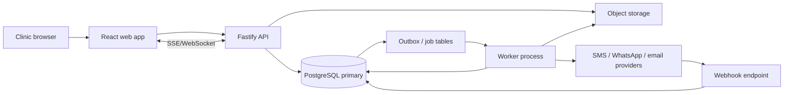

# 05 System Architecture and Delivery Stack

## 0. Build Phases

Phase tags define delivery order, not eventual scope. A later-phase table may be migrated early to preserve foreign-key shape, but its route, command, worker, and report remain disabled until that phase's acceptance gate passes. A control tagged for an earlier phase exposes only the behavior assigned to that phase; later commands on the same route remain permission- and feature-flag-gated.

### Phase 1 (MVP)

Ship the smallest clinically useful, secure single-clinic workflow:

- Identity, authentication, minimum RBAC, audit, outbox, idempotency, clinic context, staff links, and session controls required to operate the MVP safely.
- Patient Registry registration, identity/contact/address data, medical responses, allergies, consents, patient search, profile editing, and patient activity context.
- Scheduler resource availability, care bookings, booking status history, Clinical Queue admission, unscheduled encounters, encounter status flow, and the Scheduler-to-Clinical Queue handoff.
- Service and fee masters required to compose draft/basic Fee Statements, line/tax/discount arithmetic, and immutable issue/posting infrastructure that does not invoke an `UNRESOLVED-xx` decision.
- The three Phase 1 report contracts: `Priority Views / Patient Encounters Register`, `Booking Operations / Care Booking List`, and `Patient Intelligence / Daily Register Patients`.

Phase 1 does not enable automatic Fee Allocation, final period-rollover numbering behavior, Open Fee Exposure aging, multi-clinician applied-collection attribution, refund-of-allocated-funds behavior, or the single-versus-split-tender decision. Any Phase 1 screen containing such a future control renders that control unavailable with its blocker ID; draft Fee Statement arithmetic and synthetic fixture testing remain available without choosing a blocked policy.

### Phase 2 (Financial Completion and Analytics)

Begin only after `FIN-DEC-01` through `FIN-DEC-06` pass and the six decisions in document 08 have approved versioned decision records:

- Enable final document-number allocation, Collection entry model, manual or approved automatic Fee Allocation, tender/line distribution, credits, relief, refunds, reversals, journals, clinician attribution, clinician remuneration, unsettled balances, and Open Fee Exposure aging.
- Enable the full Financial Operations route, every financial worker and reconciliation projection, governed export, and all report leaves not named in Phase 1.
- Remove a blocker marker only when its selected behavior, migration effect, configuration schema, API contract, and UAT evidence have been updated together.

### Phase 3 (Extended Practice Operations)

Ship the remaining declared scope without deleting or abbreviating it:

- Multi-clinic administration, complete practice configuration, patient merge, backup/restore operations, document output design, and advanced governance surfaces.
- Odontogram, diagnostics, clinical cases, dual-clinician consultation attribution, care plans and treatment bundles, delivered care, clinical notes, patient files, laboratory operations, inventory, expenses, suppliers, and patient education.
- Continuity/recall automation, orthodontic tracking, Comms Center, SMS/WhatsApp/email gateways, medication catalogs/protocols/orders/signatures, clinical safety expansion, and clinician-share administration not already required by approved Phase 2 settlement.

Each phase has an independent release decision in document 07. Phase 1 may pass and ship while Phase 2 and Phase 3 tests remain pending; a failed later-phase test cannot silently enable its tagged artifact.

## Architectural Goal

Build Project DentOS as a fast, keyboard-efficient, multi-clinic dental operations application with a first-party domain model, first-party interaction language, deterministic accounting, and auditable healthcare workflows.

## Architectural Commitments

- Replaces a generic SaaS/dashboard direction with a dense application shell and route-preserving modal workflow.
- Makes financial operations commands transactional and idempotent.
- Adds a reliable outbox, background workers, reconciliation, and per-clinic report projections.
- Treats document serials and configuration as versioned domain services.
- Adds explicit security boundaries for clinical, financial, analytics, patient-resolution, backup, and configuration actions.

## 1. Recommended Stack

### Web application

- React 19 + TypeScript + Vite
- React Router for application routes and deep links
- TanStack Query for server state and targeted invalidation
- React Hook Form + Zod for compact validated forms
- TanStack Table + TanStack Virtual for high-density grids
- FullCalendar core for Month/Week/Day; a virtualized CSS-grid resource matrix for Resource Day/Resource Week using the same event model
- Floating UI/Radix primitives for accessible menus, dialogs, and tooltips, styled to the compact design tokens in `06_ui_and_menu_hierarchy.md`
- date-fns/date-fns-tz and rrule for calendar math
- WAI-ARIA combobox primitives with virtualized result lists, `aria-activedescendant`, AbortController cancellation, and a 120 ms type-ahead debounce for diagnosis, service, medication, and medication-protocol selectors

Avoid a card-based admin template. The primary components are toolbar, filter strip, data grid, split panel, modal form, calendar matrix, and print surface.

### API and domain

- Node.js LTS + TypeScript
- Fastify with modular domain packages; controllers, guards, transactions, and OpenAPI contracts use the Fastify implementation described in this file
- PostgreSQL 16+
- Drizzle ORM or Kysely for typed SQL; use explicit SQL for reports, exclusion constraints, row locks, and ledger postings
- OpenAPI contracts generated/validated in CI
- WebSocket or Server-Sent Events for same-clinic Scheduler and Clinical Queue refresh

### Jobs and integrations

- PostgreSQL-backed queue (`pg-boss` or Graphile Worker) for the initial deployment
- Transactional outbox in PostgreSQL
- Dedicated worker process using the same domain packages
- SMS/WhatsApp provider adapter with MSG91/Gupshup/WhatsApp Cloud API implementations
- S3-interoperable object storage for clinical files, medication-order renderings, exports, and encrypted backups. The specified Project DentOS Medication Order workspace exposes `Save`, not a separate `Sign` action; cryptographic signing is therefore feature-gated in the UI, while the schema, authorization, canonical hashing, immutable state, and signed rendering path remain fully implemented.

This stack can begin on low-cost/free tiers without introducing Redis. Redis may be added for high-frequency cache/pub-sub, never as the accounting source.

## 2. Deployment Topology



Initial hosting options:

| Layer | Low-cost option | Scale-up path |
|---|---|---|
| Static web | Cloudflare Pages/Vercel | CDN with immutable assets |
| API/worker | Render/Railway/Fly.io | regional containers/Kubernetes only when needed |
| PostgreSQL | Neon/Supabase managed Postgres | dedicated HA Postgres with PITR/read replica |
| Storage | Cloudflare R2/Supabase Storage | replicated S3-interoperable storage |
| Monitoring | Sentry + structured logs | OpenTelemetry collector and managed observability |

## 3. Modular Monolith Boundaries

Start as one deployable API with strict modules:

```text
identity-access
practice-directory
system-configuration
document-output
numbering-policies
patient-registry
scheduler
clinical-queue
diagnostics-odontogram
care-planning
medication-studio
clinical-note-library
continuity-engine
financial-operations
allocation-ledger
clinician-remuneration
comms-center
practice-assets
laboratory-operations
inventory-control
deep-analytics
patient-files
resilience-audit
```

Rules:

- Modules own their tables and command handlers.
- Cross-module writes occur through domain services in one transaction or through outbox events after commit.
- Deep Analytics may join across owned read models but may not mutate operational sources.
- Financial invariants live in Financial Operations and Allocation Ledger, never in presentation handlers.

## 4. Route and Menu Contract

Primary operational routes:

```text
/dashboard
/clinical-queue
/scheduler
/patient-registry
/practice-assets
/comms-center
/financial-operations
/deep-analytics
/system-configuration
```

Account/utility routes:

```text
/account/profile
/account/clinic-context
/account/session-security
/system-configuration/data-operations/backup-run
/system-configuration/data-operations/duplicate-patient-resolution
/system-configuration/practice-workforce
/system-configuration/workforce/:staffId
/system-configuration/access/users/:userId
/system-configuration/access/roles
```

Modal and deep-link route registry:

```text
/patient-registry/new
/scheduler/bookings/new?date=&clinician=&operatory=
/clinical-queue/encounters/new?date=
/financial-operations/collections/new?patient=
/practice-assets/expenses/new?date=
/patient-registry/:id/care-overview
/patient-registry/:id/activity-stream
/patient-registry/:id/odontogram
/patient-registry/:id/diagnostics
/patient-registry/:id/care-plan
/patient-registry/:id/delivered-care
/patient-registry/:id/clinical-notes
/patient-registry/:id/medication-orders
/patient-registry/:id/fee-statements
/patient-registry/:id/collections
/patient-registry/:id/lab-cases
/patient-registry/:id/files
/patient-registry/:id/communications
/deep-analytics/:domain/:reportKey
```

The application preserves clinic, operational date, filters, selected row, patient tab, and scroll position when a sheet or dialog closes. Public routes, API paths, event names, database identifiers, permission codes, logs, and exported metadata use the DentOS vocabulary in this suite.

## 5. API Pattern

### Commands

Mutating endpoints accept:

```text
Idempotency-Key header
If-Match row version for edits
actor/clinic from authenticated session
explicit reason for privileged reversal/override
```

Command route registry:

```text
POST /api/patients
PUT  /api/patients/:id/intent-tier
POST /api/patients/:id/clinical-cases
POST /api/clinical-cases/:id/consultations
POST /api/clinical-cases/:id/treatment-bundles
PUT  /api/treatment-bundles/:id
POST /api/clinical-cases/:id/state-corrections
POST /api/care-bookings
POST /api/care-bookings/:id/reschedule
POST /api/care-encounters/from-booking
POST /api/care-encounters/unscheduled
POST /api/care-encounters/:id/check-in
POST /api/care-encounters/:id/engage
POST /api/care-encounters/:id/check-out
POST /api/care-encounters/:id/medication-orders/drafts
PUT  /api/medication-orders/:id/draft
POST /api/medication-orders/:id/save
POST /api/medication-orders/:id/sign
POST /api/medication-orders/:id/void
POST /api/system-configuration/diagnosis-catalog
PUT  /api/system-configuration/diagnosis-catalog/:id
POST /api/system-configuration/service-catalog
PUT  /api/system-configuration/service-catalog/:id
POST /api/system-configuration/medication-domains
PUT  /api/system-configuration/medication-domains/:id
POST /api/system-configuration/active-ingredients
PUT  /api/system-configuration/active-ingredients/:id
POST /api/system-configuration/medication-catalog
PUT  /api/system-configuration/medication-catalog/:id
POST /api/system-configuration/administration-patterns
PUT  /api/system-configuration/administration-patterns/:id
POST /api/system-configuration/medication-protocols
PUT  /api/system-configuration/medication-protocols/:id/draft
POST /api/system-configuration/medication-protocols/:id/activate
POST /api/system-configuration/medication-protocols/:id/retire
POST /api/fee-statements/:id/issue
POST /api/collection-receipts
POST /api/fee-allocations
POST /api/fee-allocations/:id/reverse
POST /api/collection-refunds
POST /api/stock-documents/:id/post
POST /api/system-configuration/staff
POST /api/security/users
POST /api/security/users/:id/link-staff
POST /api/security/users/:id/clinic-memberships
POST /api/security/users/:id/roles
PUT  /api/security/users/:id/permission-overrides
POST /api/security/users/:id/disable
POST /api/security/users/:id/unlock
POST /api/security/users/:id/password-reset
```

### Queries

```text
GET /api/dashboard?scope=&operationalDate=
GET /api/scheduler?view=&from=&to=&clinician=&operatory=
GET /api/patients?query=&filters=&sort=&page=
GET /api/clinical-queue?date=&clinician=&careStream=&query=
GET /api/patients/:id/profile
GET /api/patients/:id/intent-tier-history
GET /api/patients/:id/clinical-cases
GET /api/clinical-cases/:id
GET /api/clinical-cases/:id/state-history
GET /api/patients/:id/activity-stream
GET /api/patients/:id/odontogram
GET /api/patients/:id/diagnostics
GET /api/patients/:id/care-plans
GET /api/patients/:id/delivered-care
GET /api/patients/:id/clinical-notes
GET /api/patients/:id/medication-orders
GET /api/care-encounters/:id/medication-context
GET /api/diagnosis-catalog?query=&limit=
GET /api/service-catalog?query=&domain=&limit=
GET /api/medication-catalog/search?query=&domainId=&limit=
GET /api/medication-protocols/recommendations?diagnosisIds=&serviceIds=
GET /api/medication-protocols/:id/versions/:version
GET /api/system-configuration/diagnosis-catalog?query=&status=&page=
GET /api/system-configuration/service-catalog?query=&domain=&status=&page=
GET /api/system-configuration/medication-catalog?query=&domain=&ingredient=&status=&page=
GET /api/system-configuration/administration-patterns?query=&status=&page=
GET /api/system-configuration/medication-protocols?query=&status=&page=
GET /api/patients/:id/fee-statements
GET /api/patients/:id/collections
GET /api/patients/:id/lab-cases
GET /api/patients/:id/files
GET /api/patients/:id/communications
GET /api/patients/:id/ledger
GET /api/deep-analytics/:reportKey?filters=
GET /api/system-configuration/practice-workforce
GET /api/security/roles
GET /api/security/permissions
GET /api/security/users/:id/effective-permissions?clinic=
GET /api/session/capabilities?clinic=
```

Return stable machine keys plus display labels. Financial responses include source IDs and row versions for safe continuity commands.

### Authorization middleware

Every route declares one or more permission codes in server metadata:

```ts
POST /api/security/users       -> security.user.create
PUT  /api/fee-statements/:id         -> fee_statement.edit_draft
POST /api/fee-statements/:id/void    -> fee_statement.void
POST /api/care-deliveries/:id/complete -> care_delivery.complete
GET  /api/medication-masters/diagnoses -> medication_order.create
GET  /api/medication-masters/services -> medication_order.create
GET  /api/medication-catalog/search -> medication_order.create
GET  /api/medication-protocols/recommendations -> medication_order.create
GET  /api/medication-protocols/:id/versions/:version -> medication_order.create
GET  /api/system-configuration/medication-domains -> configuration.practice.view
POST /api/system-configuration/medication-domains -> configuration.practice.edit
PUT  /api/system-configuration/medication-domains/:id -> configuration.practice.edit
GET  /api/system-configuration/active-ingredients -> configuration.practice.view
POST /api/system-configuration/active-ingredients -> configuration.practice.edit
PUT  /api/system-configuration/active-ingredients/:id -> configuration.practice.edit
GET  /api/system-configuration/diagnosis-catalog -> configuration.practice.view
POST /api/system-configuration/diagnosis-catalog -> configuration.practice.edit
PUT  /api/system-configuration/diagnosis-catalog/:id -> configuration.practice.edit
GET  /api/system-configuration/service-catalog -> configuration.practice.view
POST /api/system-configuration/service-catalog -> configuration.practice.edit
PUT  /api/system-configuration/service-catalog/:id -> configuration.practice.edit
GET  /api/system-configuration/medication-catalog -> configuration.practice.view
POST /api/system-configuration/medication-catalog -> configuration.practice.edit
PUT  /api/system-configuration/medication-catalog/:id -> configuration.practice.edit
GET  /api/system-configuration/administration-patterns -> configuration.practice.view
POST /api/system-configuration/administration-patterns -> configuration.practice.edit
PUT  /api/system-configuration/administration-patterns/:id -> configuration.practice.edit
GET  /api/system-configuration/medication-protocols -> configuration.practice.view
POST /api/system-configuration/medication-protocols -> configuration.practice.edit
PUT  /api/system-configuration/medication-protocols/:id/draft -> configuration.practice.edit
POST /api/system-configuration/medication-protocols/:id/versions -> configuration.practice.edit
POST /api/system-configuration/medication-protocols/:id/activate -> configuration.practice.edit
POST /api/system-configuration/medication-protocols/:id/retire -> configuration.practice.edit
POST /api/medication-orders/:id/save -> medication_order.create
POST /api/medication-orders/:id/sign -> medication_order.sign
POST /api/medication-orders/:id/void -> medication_order.void
GET  /api/deep-analytics/:reportKey   -> permission from report registry
POST /api/deep-analytics/:key/export  -> report-family view + analytics.export
```

The request pipeline is mandatory and ordered:

```text
1 authenticate signed session; reject expired/revoked session
2 require active user and matching credential/session authz_version
3 derive organization and active clinic from the session context
4 require active clinic_membership; never trust client organization/clinic IDs
5 load permission code declared by route/report registry
6 calculate effective permission: explicit deny > explicit allow > role grant > deny
7 enforce resource policy: row organization/clinic, ownership, state, and field scope
8 validate command, row version, idempotency key, and privileged reason
9 execute domain transaction; append audit/outbox; return capability-safe response
```

Authorization is implemented as Fastify pre-handlers plus domain-command guards, not controller convention. Query builders receive a mandatory authorization scope and PostgreSQL transactions set organization/clinic RLS context. A direct URL, manually constructed API request, stale browser button, background export, or WebSocket subscription cannot bypass the same checks.

Permission caches are keyed by `(user_id, clinic_id, authz_version)`. User status, role, override, or membership changes increment `authz_version`, publish `security.capabilities_changed`, and revoke/refresh sessions. Sensitive denials such as report export, Fee Statement void, Collection refund, user administration, and backup are audited without logging credentials or patient data.

## 6. Transaction Boundaries

### Care Booking save

```text
lock/check clinician-chair interval
insert/update care booking
insert status history + audit + outbox
commit
```

### Scheduler to Clinical Queue

```text
lock care booking
get/create one encounter
allocate queue sequence
update care booking state
insert histories + audit + outbox
commit
```

### Collection Receipt and application

```text
validate exactly one collection method for a DentOS core collection entry
lock collection/fee statement in deterministic order when an application is made
insert collection or application/distributions
recalculate source balances
post journal
insert audit + outbox
commit
```

### Service completion and custom continuity

```text
require care_delivery.complete and active clinic membership
lock care_deliveries, linked care_plan_services, care_encounters, and patients in ascending UUID order
verify If-Match row_version and require current service status planned or in_progress
accept completion_continuity_mode only as none, rule, or custom_date
for rule, resolve the active service-specific rule, then category-specific rule, then clinic-wide rule
for custom_date, require clinic-local date strictly after the completion local date, require a valid local time, and convert with the clinic IANA timezone
set status completed, completed_at, completed_by, completion_continuity_mode, custom date/time fields, notes, and updated_by
mark the linked care plan item completed when present
insert exactly one continuity_tasks row for rule or custom_date using source_type care_delivery and source_id service ID
insert service status history, continuity history, audit rows, and care_delivery.completed outbox event
commit all rows together; any authorization, date, rule, duplicate, or row-version error rolls back the complete transaction
```

The endpoint is idempotent on `(care_delivery_id, completion_event_id)`. A retry returns the committed completion and continuity identifiers. The deferred schema trigger rejects a completed service whose selected `rule` or `custom_date` mode lacks its non-cancelled continuity row. Provider messages are never sent in this transaction; the continuity workers materialize channel-specific reminders after commit.

### Medication Order draft, save, and sign

```text
authenticate clinic scope and resolve medication_order.create, medication_order.edit_draft, or medication_order.sign for the exact command
lock care_encounters and the existing draft medication order in ascending UUID order
verify patient, clinic, clinician, staff-clinic assignment, row version, and idempotency key
resolve diagnosis, service/domain, medication, active ingredient, administration pattern, allergy mapping, and protocol version from PostgreSQL
insert or update one draft medication_orders parent
replace ordered medication_order_diagnoses, medication_order_service_links, and medication_order_lines only while parent status is draft
run the allergy-to-active-ingredient safety query against the locked clinical snapshot
for Save, set saved_at, saved_by, and status saved
for Save and Sign, recheck medication_order.sign and active user-clinician link; hash canonical clinical JSON; set saved and signed metadata plus status signed
insert audit, outbox, and idempotent response rows
commit
```

Protocol activation is a separate configuration transaction. It requires `configuration.practice.edit`, locks the draft protocol and its mapping rows, validates organization consistency and at least one active medication line, changes status to active, appends `medication_protocol.activated`, and evicts organization-scoped type-ahead/recommendation caches after commit.

The specified patient and Dashboard `Record Collection` forms do not display a fee statement selector or an `Apply` command. Therefore collection capture and fee settlement remain separate domain operations even if a configurable server policy performs settlement immediately after capture. A multi-tender collection receipt may be added as an explicitly enabled modern extension; in DentOS core mode, Cash + UPI is represented by two collection receipt records.

No external API call occurs inside these transactions.

## 7. Real-Time Update Model

Events are clinic-scoped:

```text
care_booking.created/updated/cancelled
care_encounter.created/status_changed
patient.updated
medication_protocol.activated
medication_protocol.retired
medication_order.saved
medication_order.signed
medication_order.voided
fee_statement.issued/voided
collection_receipt.created/voided/refunded
fee_allocation.created/reversed
stock.posted
message.status_changed
```

Clients subscribe to authorized clinic channels. On event, invalidate only affected query keys/ranges. The event carries no unnecessary patient details. Reconnect resumes from last event ID or performs a targeted refresh.

Optimistic updates are allowed for cosmetic settings and filters. Financial posting, serial allocation, queue sequence, and care booking conflict resolution wait for authoritative server response.

## 8. Background Jobs

| Queue | Job | Retry/idempotency |
|---|---|---|
| communications | welcome/reminder/routine/bulk send | one provider submit per message ID |
| communications | webhook apply | unique provider event ID |
| recalls | make due/contact queues | patient-rule-source unique key |
| reports | refresh clinic/date partitions | source event ID |
| balances | rebuild patient/fee statement projections | latest aggregate version |
| inventory | low-stock/expiry alert | one open alert per item/batch |
| lab | due/overdue alert | one open alert per job/status |
| backup | encrypted backup/export | request ID |
| maintenance | reconciliation | clinic/date/job run key |
| clinical-case | reconcile applied-payment progression | clinic/date/application watermark |

Dead-letter jobs are visible to admins with error, attempts, next action, and safe replay. No worker silently marks a financial source successful after partial failure.

## 9. Reporting Architecture

The report engine has four layers:

```text
immutable/dated source transactions
  -> canonical fact views
  -> report registry + typed filter compiler
  -> grid/print/export renderers using one result contract
```

Canonical financial fact families are deliberately separate:

| Fact family | Grain | Authoritative date/user | Must never be joined into its sum |
|---|---|---|---|
| `collection_activity` | one collection receipt tender | collection receipt date / `collection_operator_id` cashier | fee allocations or fee statement lines |
| `refund_collection` | one refund tender | refund date / `processed_by`; original cashier retained | applications |
| `allocated_collection` | one application distribution | application date / `applied_by`; line clinician | gross collection receipt total |
| `fee_statement_due_as_of` | one Fee Statement at requested cut-off | as-of date; Fee Statement category snapshot | unapplied collection receipt advance |
| `fee_statement_line_due_as_of` | one Fee Statement line at cut-off | as-of date / lead clinician | fee statement header duplicated per line |
| `case_conversion` | one finalized initial consultation/case | clinic-local consultation date / primary and secondary doctor snapshots | collection receipt totals without qualifying fee allocation |
| `case_bundle_domain` | one case, bundle tier, service domain | clinic-local consultation date / bundle service snapshots | repeated services counted as repeated consultations |

The shared report registry stores:

```text
report_key, exact_display_label, category, fact_family
permission_code, authoritative_date_field, query_version
allowed_filter_schema, required_filter_schema, default_sort
column_schema, grouping_schema, total/reconciliation_contract
source_sql_id, projection_name nullable, freshness_sla_seconds
drilldown_report_key, print_template_key, export_formats, active
```

The filter compiler always injects authorized `clinic_ids` and validates Date Range, As-of Date, Clinician Split/filter, Patient Category/basis, cashier, and collection-mode codes. Query text never accepts raw column names, sort expressions, or SQL fragments from the browser.

product-contract implementations are versioned source SQL from document 04:

- `due_fee statements_pending_fees`: recalculates dated applications/credits/write-offs as of the selected date, uses non-overlapping aging buckets, category snapshot/current basis, `exists` clinician filter, and optional exact line-level Clinician Split.
- `date_wise_total_collections`: aggregates collection receipt-tender facts by collection receipt date, clinic, cashier, and stable mode code; pivots Cash/UPI/Card/Net Banking/Other; aggregates collection_refunds separately; never substitutes fee allocations.
- `date_wise_allocated_collections`: independently aggregates application distributions by application date, applier, line clinician, and mode.
- `monthly_total_category_consultations`: counts one finalized initial consultation per distinct saved service domain and clinic-local month.
- `high_intent_pipeline_bottleneck`: fixes the cohort to intent tier `three_star_high_intent_friction` and case state `not_started` as of the selected clinic-local date.
- `doctor_wise_clinical_conversion_ratios`: groups finalized initial consultations by immutable Primary Consult Doctor and divides cases whose exact state is `treatment_started` by total initial consultations.
- `high_value_category_conversions`: restricts service domains to `high_value = true` and attributes consultation volume, Treatment Started volume, advised value, and converted advised value independently to primary or secondary consultation doctors.
- `cross_tier_matrix_generator`: pivots consultation counts, started counts, and zero-safe conversion percentages across all three intent-tier snapshots.
- `pending_priority_treatment_registers`: produces separate Primary and Secondary bundle queues with proposed, applied, remaining, pending-age, clinician, and next-action columns.

Operational grids may query normalized tables directly. High-volume current summaries use clinic/date-partitioned materialized projections. Historical `:as_of_date` aging falls back to dated source SQL unless an exact daily snapshot exists. Every API response includes `source_as_of`, `query_version`, effective filters, category basis, aging-boundary version, and projection freshness.

Projection refresh events:

| Source event | Affected projections |
|---|---|
| Fee Statement issue/void/date correction | production, current due, aging |
| Collection create/void | collection by date/cashier/mode, unsettled |
| Refund post/reverse | refund/net collection, unsettled |
| Application create/reverse | applied by clinician/mode, current due, aging, unsettled |
| Qualifying Application create | case conversion, bundle-domain value, bottleneck, priority register; invoke transactional state progression |
| Consultation finalize/correct | consultation volume, conversion, cross-tier, high-value, bottleneck |
| Bundle create/update | category consultation, high-value, priority register |
| Patient intent-tier change | current cohort cache only; historical consultation snapshots remain unchanged |
| Credit/write-off create/reverse | current due, aging, clinician split |
| Role/membership change | no financial recompute; invalidate authorized report cache |

Projection updates are idempotent by source event ID. Nightly reconciliation compares projection totals with source SQL by clinic/date. A stale or mismatched projection is never silently served as authoritative; the endpoint uses source SQL or returns a clear unavailable state.

Exports run asynchronously above a row threshold, but the worker receives a signed immutable filter snapshot and rechecks the requesting user's report permission and clinic scope. Grid, total footer, print, PDF, and spreadsheet use the same query version/result set. Completed files use short-lived signed links.

Report caches are keyed by organization, sorted clinic scope, report key/query version, every effective filter, timezone, user permission scope/authz version, and source/projection watermark. Omitting any key component is a data-leak or stale-total defect.

## 10. System Configuration Architecture

Typed pages implement the signed-in live hierarchy:

```text
Clinic: Clinic, Clinicians/Staff, Theme, Chairs, New Clinic
Schedule: Clinic Timings, Care Booking Reasons, Schedule Options, Subscribe
Patients: Referral Source, Initials, Categories, Flags, Occupation, Custom Fields
Dental Chart: Service Categories, Chart Options, Materials, Advanced, Bridges
Application: Serials, Sender ID, SMS/email, WhatsApp
Document Output: Fee Statement, Collection Receipt, Clinical Summary, Medication Order, Care Plan
EMR: Allergies, Risk Factors, Treatment Priorities, Document Tags
Medication Orders: Medication Domains, Active Ingredients, Medication Catalog, Administration Patterns, Medication Protocols
Note Assist: Note Templates, Custom Forms, Clinical Note Options, FeedBack Templates
Accounts: Collection Methods, Account Heads, Fee Schedules, Fee Statement Categories
Inventory: Stock Categories, Items
Dental Lab: Lab Work, Lab Work Steps, Quality options
App Options: no verified child controls are enabled in DentOS core mode; the route renders a locked specification-review state and contains no speculative controls
Data Operations: Backup Run, Restore Drill, Duplicate Patient Resolution, Import Queue, Export Queue
```

System Configuration -> Practice and Workforce uses one split workspace: `Practice Identity` options are grouped in the left pane and `Workforce and Access` options in the right pane. The right pane owns the staff grid, staff editor, Create Login/Link Login actions, account status, clinic memberships/default clinic, role assignment, granular permission matrix, overrides, unlock/reset, and Disable Login. At desktop/laptop widths the panes remain side-by-side; this is a structural contract, not a responsive card layout.

Configuration API returns schema, current value, effective scope, inherited value, version, and permission. Typed master data has active/inactive lifecycle; historical references remain valid.

### Medication Order master service

The Medication Orders configuration leaves are `Medication Domains`, `Active Ingredients`, `Medication Catalog`, `Administration Patterns`, and `Medication Protocols`. The Medication Protocols editor contains explicit `Diagnosis Links` and `Service Links` tabs. `Diagnosis Links` opens the organization-scoped Diagnosis Catalog in a compact side panel; `Service Links` searches the Service Catalog and always displays its domain.

The service owns these table groups:

| Master command | Written tables | Read-time consumers |
|---|---|---|
| Save diagnosis | `diagnosis_catalog` | diagnosis type-ahead, encounter diagnosis, protocol recommendation |
| Save service/domain | `service_domains`, `service_catalog` | service type-ahead, care plan, encounter recommendation, protocol recommendation |
| Save medication | `medication_catalog`, `medication_domain_links`, `medication_ingredient_links`, `medication_strength_options`, `medication_administration_defaults` | medication type-ahead, protocol-line editor, allergy gate, medication-order draft |
| Save administration pattern | `administration_patterns` | medication default administration, protocol-line editor, medication-order line editor |
| Save allergy mapping | `allergy_ingredient_rules` | patient-specific medication order safety gate |
| Save protocol draft | `medication_protocols`, `medication_protocol_lines`, `medication_protocol_diagnosis_links`, `medication_protocol_service_links` | recommendations and protocol expansion |

Every master mutation requires `configuration.practice.edit`. Read-only configuration pages require `configuration.practice.view`. Patient medication order type-ahead endpoints require `medication_order.create`; they return only active masters and never expose draft protocol versions. `medication_order.sign` does not grant any master-data mutation, and `configuration.practice.edit` does not grant medication order signing.

PostgreSQL `pg_trgm` indexes serve normalized type-ahead directly on the initial deployment. The API applies a hard limit of 20 diagnosis rows, 20 service rows, 30 medication rows, and 10 recommendations. Query text is trimmed, Unicode-normalized, lowercased, and limited to 80 characters before SQL binding. Exact codes, code prefixes, priority pins, trigram similarity, display order, label, and UUID form the complete deterministic sort keys defined in document 02.

TanStack Query keys are exact tuples:

```text
['rx-diagnoses', organizationId, masterVersion, normalizedQuery]
['dentos-services', organizationId, catalogRevision, normalizedQuery, domainId]
['dentos-medications', organizationId, catalogRevision, normalizedQuery, domainId]
['dentos-protocol-recommendations', organizationId, catalogRevision, sortedDiagnosisIds, sortedServiceIds]
['dentos-protocol-version', organizationId, protocolId, version]
```

The browser waits 120 ms after the latest keystroke, cancels the preceding request with AbortController, and ignores responses whose request sequence is older than the visible query. The API may maintain a 60-second in-process cache keyed by the complete tuple. `medication_protocol.activated`, `medication_protocol.retired`, diagnosis update, service update, medication update, administration-pattern update, active-ingredient update, domain update, strength-option update, ingredient-link update, or allergy-map update increments the organization catalog revision after commit; a revision change makes every older cache key unreachable without explicit key deletion.

Protocol activation uses PostgreSQL as the authority. The cache never decides status, organization ownership, version, medication membership, administration-pattern membership, or recommendation score. Medication Order save resolves every ID and safety mapping again inside the transaction.

Serial allocation is a dedicated service using locked counters. The specified grid contains `Patient Code`, `Collection Reference`, `Statement Reference`, `Lab Order No.`, `Exp. Voucher`, `Goods In`, and `Goods Out`, with generation choices `Manual Serial Number`, `Year based Serial`, and `Year Month based Serial`, plus Prefix, Start From, Generate, and Edit controls. Prefix or generation changes are versioned and cannot alter issued numbers.

Document Output use one shared typed schema per document type: page size (A3/A4/A5/B5/Ledger/Legal/Letter/Custom), orientation, logo placement, barcode type/size/text/placement, header/footer fields, margins, spacing, font, and options. Each Save creates a versioned template; Reset restores the clinic-effective default without mutating historical print snapshots.

## 11. Security and Privacy

- Local credentials use Argon2id and unique organization-scoped login names; optional OIDC identities may link to the same user principal.
- Secure HttpOnly same-site session cookies; session records carry `authz_version` and are revocable immediately.
- Optional MFA/OTP based on account configuration.
- Organization RLS and clinic-membership enforcement.
- Default-deny permission checks on every command, query, report, export, file access, WebSocket subscription, and privileged worker job; UI hiding is only convenience.
- Staff profiles and login users have an explicit one-to-one link and independent active/disabled lifecycles.
- Users cannot grant permissions above their delegation ceiling or disable/demote the last active security administrator.
- Passwords, temporary credentials, reset tokens, session tokens, and hashes never appear in API responses, audit payloads, exports, or logs.
- Clinical and financial records encrypted at rest; TLS in transit.
- Government IDs encrypted with masked display and no plaintext logs.
- Signed object-storage URLs with short expiry and patient/clinic authorization.
- Webhook signature verification, replay window, provider event deduplication.
- CSRF protection for cookie-authenticated mutations.
- Rate limiting for login, patient search, bulk messaging, reports, and exports.
- Append-only audit; sensitive field values redacted from application logs.

## 12. Performance Budgets

On a normal clinic broadband connection and representative dataset:

| Interaction | p95 target |
|---|---|
| Shell/navigation switch | under 300 ms after cached shell |
| Patient search first page | under 700 ms |
| Clinical Queue filter/sort | under 500 ms |
| Care Booking save/conflict result | under 1 s |
| Check-in/Engage state update | under 700 ms |
| Diagnosis type-ahead first page | under 250 ms |
| Suggested-service type-ahead first page | under 250 ms |
| Medication type-ahead first page | under 300 ms |
| Medication Order recommendation and template expansion | under 350 ms recommendation; under 300 ms expansion |
| Medication Order Save or Save and Sign acknowledgement | under 900 ms |
| Collection Receipt/application posting | under 1.2 s |
| Standard report first page | under 2 s |
| 50k-row export request acknowledgement | under 500 ms, async completion |

Grids virtualize rows, keep stable column widths, and request server paging. No route ships all patient/report rows to the browser.

## 13. Availability, Backup, and Recovery

- Automated encrypted daily backup plus point-in-time recovery in production.
- Quarterly restore test with documented recovery time and recovery point.
- Object storage versioning/lifecycle for clinical files.
- Health checks cover API, database, worker lag, outbox lag, provider adapter, and projection freshness.
- Graceful degradation: clinical/scheduling read remains available when messaging provider is down; message jobs queue for later.
- Financial posting fails closed if ledger transaction cannot complete.

## 14. Testing Strategy

- Unit tests: money rounding, serial rendering, state transitions, aging boundaries 0/30/31/60/61/90/91, signed refund effects, collection-mode pivots, opt-out, allocation algorithms, effective-permission precedence, delegation ceilings, medication-order recommendation score/tie ordering, administration override precedence, canonical signature hashing, and allergy action precedence `block > warn > information`.
- Property tests: applications/collection_refunds never make balances negative; distributions always sum to source.
- Integration tests: PostgreSQL row locks, exclusion constraints, RLS, journal balance, outbox atomicity, session invalidation, forged-request authorization denial, cross-organization medication order-master rejection, immutable active protocol versions, encounter/patient/clinic medication order alignment, signed child-row locking, and render idempotency by medication order/status/version.
- Contract tests: SMS/WhatsApp provider adapters and webhooks.
- UI tests: every route, patient workspace tab, modal, filter, keyboard flow, dense grid, print/export, DentOS core single-mode collection form, diagnosis/service/medication combobox cancellation, protocol replacement/append choices, fixed-height medication lines, and the measured 30-second medication-order path.
- Visual regression: desktop reference viewport and minimum supported laptop width using scrubbed fixtures.
- Reconciliation tests: all equalities in `04_reporting_analytics_queries.md`, including source/projection/export reconciliation for Open Fee Exposure and Collection Activity by Date.
- UAT: the complete suite in `07_acceptance_criteria.md`.

## 15. Build Sequence

1. Identity, Clinic-left/Clinician-Staff-right settings, staff-login linkage, clinic switch, roles/overrides, authorization middleware, shell, and document series.
2. Patient registry/profile and master data.
3. Scheduler views, conflicts, blocks, and Dashboard quick entry.
4. Clinical Queue handoff and queue state machine.
5. Clinical charting, plans, medication order, recall/continuity.
6. Fee Statement, single-mode collection entry, applications, ledger, reversals/collection_refunds; add split tenders only as an optional extension.
7. Canonical collection receipt/refund/application facts; exact Open Fee Exposure aging and Collection Activity by Date SQL; production, applied-collection, due, and unsettled reports.
8. Clinician share, expenses, lab, inventory.
9. Communications and provider webhooks.
10. Full visual/UAT conformance pass with dummy data and approved DentOS evidence.

Release is blocked until the acceptance suite passes with the same source fixture across UI grids, exports, and ledger reports.

<!-- ZERO_SHORTCUT_EXPANSION -->

## 16. Route Authorization and State Contract

| Method and route | Permission | Input state | Success state | Failure state | Audit/outbox |
|---|---|---|---|---|---|
| POST /api/patients | patient.create | registration draft valid | patient active with clinic link | 400 validation, 409 duplicate, 403 permission | patient.create audit; patient.created |
| PUT /api/patients/:id/intent-tier | patient.intent_tier.edit | active patient; replacement tier differs; permitted reason; blank note or 1-1000 trimmed characters; matching row version | patient current tier updated and one immutable tier event appended | 403 permission, 404 scope, 409 stale/same tier, 422 reason/note | patient.intent_tier.change audit; patient.intent_tier.changed |
| POST /api/patients/:id/clinical-cases | clinical_case.create | active patient and encounter; consultation objective; patient intent tier present | one open clinical case with tier snapshot and not_started initial state | 403 permission, 404 scope, 409 duplicate active initial case, 422 missing objective/tier | clinical_case.create audit; clinical_case.created |
| POST /api/clinical-cases/:id/consultations | case_consultation.finalize | authorized open case; primary and secondary clinicians active and distinct; objective and summary valid; one valid Primary bundle | immutable finalized initial consultation; doctor and intent snapshots; requested execution state; initial state event | 403 permission, 404 scope, 409 duplicate/stale/finalized, 422 doctors/objective/summary/bundle/state | case_consultation.finalize audit; case_consultation.finalized; clinical_case.state_changed when state changes |
| POST /api/clinical-cases/:id/treatment-bundles | treatment_bundle.manage | authorized open case; unique active tier; label; state; one or more linked care-plan services from same patient | bundle and ordered service snapshots committed atomically | 403 permission, 404 scope, 409 duplicate tier/stale link, 422 invalid tier/service/value | treatment_bundle.create audit; treatment_bundle.changed |
| PUT /api/treatment-bundles/:id | treatment_bundle.manage | draft or presented bundle; matching row version; complete replacement service graph | bundle header and ordered services updated; historical domain snapshots retained | 403 permission, 404 scope, 409 accepted/declined/superseded or stale, 422 invalid graph | treatment_bundle.update audit; treatment_bundle.changed |
| POST /api/clinical-cases/:id/state-corrections | clinical_case.correct_state | finalized case; target state differs; nonblank controlled reason and note; matching row version | case state corrected and immutable state event appended; financial/care-delivery evidence retained | 403 permission, 404 scope, 409 stale/same state, 422 reason/note | clinical_case.state_correct audit; clinical_case.state_changed |
| PUT /api/patients/:id | patient.edit | active patient and matching row version | patient version incremented | 404 scope, 409 stale row, 403 permission | patient.update audit; patient.updated |
| POST /api/patients/:id/merge | patient.merge | survivor and duplicate valid | duplicate merged into survivor | 409 financial/identity conflict, 403 permission | patient.merge audit; patient.merged |
| POST /api/care-bookings | scheduler.create | slot request valid | care booking scheduled | 409 chair/clinician conflict, 422 invalid range | care_booking.create audit; care_booking.created |
| POST /api/care-bookings/:id/reschedule | scheduler.edit | active care booking and matching version | new interval committed | 409 conflict or stale row | care_booking.reschedule audit; care_booking.updated |
| POST /api/care-bookings/:id/cancel | scheduler.cancel | scheduled or confirmed | care booking cancelled | 409 invalid state, 403 permission | care_booking.cancel audit; care_booking.cancelled |
| POST /api/care-encounters/from-booking | queue.admit | care booking active | one linked encounter | 409 invalid care booking; retry returns existing encounter | care_encounter.create audit; care_encounter.created |
| POST /api/care-encounters/walk-in | queue.admit | walk-in form valid | one encounter and optional one patient | 409 duplicate patient policy, 422 invalid form | care_encounter.create audit; care_encounter.created |
| POST /api/care-encounters/:id/check-in | queue.admit | waiting | checked_in | 409 invalid or stale state | care_encounter.checkin audit; care_encounter.status_changed |
| POST /api/care-encounters/:id/engage | queue.engage | waiting under direct policy or checked_in | engaged | 409 invalid or stale state | care_encounter.engage audit; care_encounter.status_changed |
| POST /api/care-encounters/:id/check-out | queue.release | engaged and requirements satisfied | checked_out | 409 unresolved checkout requirement | care_encounter.checkout audit; care_encounter.status_changed |
| POST /api/care-plans | care_plan.create | valid plan and lines | plan saved | 422 empty/invalid lines | care_plan.create audit; treatment_plan.saved |
| POST /api/care-deliveries/:id/complete | care_delivery.complete | planned or in_progress; matching row version; mode none, rule, or custom_date; future local date/time when custom | completed service, linked plan item completion, and zero or one required continuity committed atomically | 403 permission, 409 state/stale/duplicate, 422 invalid rule/date/time | care_delivery.complete audit; care_delivery.completed |
| POST /api/care-encounters/:id/medication-orders/drafts | medication_order.create | authorized encounter; active clinician; idempotency key | one encounter-bound draft parent | 404 scope, 409 duplicate/stale encounter, 422 inactive clinician | medication_order.draft_create audit |
| PUT /api/medication-orders/:id/draft | medication_order.edit_draft | parent draft; matching row version; complete typed child payload | ordered diagnosis, service, and medication rows replaced atomically | 409 non-draft/stale, 422 master/safety/sequence validation | medication_order.draft_update audit |
| POST /api/medication-orders/:id/save | medication_order.create | draft with diagnosis, service, medication, safety result, and matching version | immutable saved medication order | 409 stale/state, 422 missing section or unresolved safety block | medication_order.save audit; medication_order.saved |
| POST /api/medication-orders/:id/sign | medication_order.sign | draft or saved; authenticated user linked to selected clinician; canonical payload valid | immutable signed medication order with SHA-256 metadata | 403 permission/link, 409 stale/state, 422 safety/signature input | medication_order.sign audit; medication_order.signed |
| POST /api/medication-orders/:id/void | medication_order.void | saved or signed; matching version; nonblank reason | immutable void status retaining clinical content and signature | 403 permission, 409 stale/state, 422 blank reason | medication_order.void audit; medication_order.voided |
| GET /api/system-configuration/medication-domains | configuration.practice.view | active organization scope, query, status, page, page size | paged medication-domain rows and row versions | 403 permission, 422 filter | configuration-read audit only when tenant policy requires |
| POST /api/system-configuration/medication-domains | configuration.practice.edit | unique code/name, nonnegative order | medication domain inserted; catalog revision incremented | 403 permission, 409 duplicate, 422 fields | medication_domain.create audit; medication_catalog.changed |
| PUT /api/system-configuration/medication-domains/:id | configuration.practice.edit | matching row version and organization | medication domain updated or deactivated; historical links retained | 403 permission, 409 stale/duplicate, 404 scope | medication_domain.update audit; medication_catalog.changed |
| GET /api/system-configuration/active-ingredients | configuration.practice.view | active organization scope, query, status, page, page size | paged active-ingredient rows and row versions | 403 permission, 422 filter | configuration-read audit only when tenant policy requires |
| POST /api/system-configuration/active-ingredients | configuration.practice.edit | unique code/name and normalized keywords | active ingredient inserted; catalog revision incremented | 403 permission, 409 duplicate, 422 fields | active_ingredient.create audit; medication_catalog.changed |
| PUT /api/system-configuration/active-ingredients/:id | configuration.practice.edit | matching row version and organization | active ingredient updated or deactivated; historical ingredient links retained | 403 permission, 409 stale/duplicate, 404 scope | active_ingredient.update audit; medication_catalog.changed |
| GET /api/system-configuration/diagnosis-catalog | configuration.practice.view | active organization scope, query, status, page, page size | paged diagnosis rows and row versions | 403 permission, 422 filter | configuration-read audit only when tenant policy requires |
| POST /api/system-configuration/diagnosis-catalog | configuration.practice.edit | unique code/name and valid fields | diagnosis master inserted; catalog revision incremented | 403 permission, 409 duplicate, 422 field validation | diagnosis.create audit; medication_catalog.changed |
| PUT /api/system-configuration/diagnosis-catalog/:id | configuration.practice.edit | matching row version and organization | diagnosis updated or deactivated; catalog revision incremented | 403 permission, 409 stale/duplicate, 404 scope | diagnosis.update audit; medication_catalog.changed |
| GET /api/system-configuration/service-catalog | configuration.practice.view | active organization scope, query, domain, status, page, page size | paged service rows with structural domain and row versions | 403 permission, 422 filter | configuration-read audit only when tenant policy requires |
| POST /api/system-configuration/service-catalog | configuration.practice.edit | active same-organization domain and complete service | service inserted; catalog revision incremented | 403 permission, 409 duplicate, 422 domain/field validation | service.create audit; medication_catalog.changed |
| PUT /api/system-configuration/service-catalog/:id | configuration.practice.edit | matching row version and same-organization domain | service updated or deactivated; catalog revision incremented | 403 permission, 409 stale/duplicate, 404 scope | service.update audit; medication_catalog.changed |
| GET /api/system-configuration/medication-catalog | configuration.practice.view | active organization scope, query, domain, status, page, page size | paged medication headers with domain, active ingredient, administration pattern, strength, and row-version graph | 403 permission, 422 filter | configuration-read audit only when tenant policy requires |
| POST /api/system-configuration/medication-catalog | configuration.practice.edit | valid domains, active ingredients, administration patterns, strengths, ingredient quantities, and contraindication fields | medication catalog graph inserted; catalog revision incremented | 403 permission, 409 duplicate primary mapping, 422 graph validation | medication_catalog.create audit; medication_catalog.changed |
| PUT /api/system-configuration/medication-catalog/:id | configuration.practice.edit | matching row version and complete same-organization graph | medication catalog graph version updated; master version incremented | 403 permission, 409 stale/mapping conflict, 404 scope | medication_catalog.update audit; medication_catalog.changed |
| GET /api/system-configuration/administration-patterns | configuration.practice.view | active organization scope, query, status, page, page size | paged administration-pattern rows and row versions | 403 permission, 422 filter | configuration-read audit only when tenant policy requires |
| POST /api/system-configuration/administration-patterns | configuration.practice.edit | unique code and valid take/frequency/duration values | administration pattern inserted; catalog revision incremented | 403 permission, 409 duplicate, 422 duration validation | administration_pattern.create audit; medication_catalog.changed |
| PUT /api/system-configuration/administration-patterns/:id | configuration.practice.edit | matching row version | administration pattern updated or deactivated; catalog revision incremented | 403 permission, 409 stale/duplicate, 404 scope | administration_pattern.update audit; medication_catalog.changed |
| GET /api/system-configuration/medication-protocols | configuration.practice.view | active organization scope, query, status, page, page size | paged protocol versions and row versions | 403 permission, 422 filter | configuration-read audit only when tenant policy requires |
| POST /api/system-configuration/medication-protocols | configuration.practice.edit | unique code/version and valid header | draft protocol inserted | 403 permission, 409 duplicate version, 422 fields | medication_protocol.create audit |
| PUT /api/system-configuration/medication-protocols/:id/draft | configuration.practice.edit | protocol draft and matching row version | medication, diagnosis, and service mappings replaced atomically | 403 permission, 409 active/retired/stale, 422 mapping validation | medication_protocol.draft_update audit |
| POST /api/system-configuration/medication-protocols/:id/versions | configuration.practice.edit | selected active or retired version and matching row version | version N plus 1 draft with copied ordered medication and mapping rows | 403 permission, 409 existing version/stale, 422 invalid source | medication_protocol.version_create audit |
| POST /api/system-configuration/medication-protocols/:id/activate | configuration.practice.edit | draft, matching version, at least one active medication line | immutable active version; catalog revision incremented | 403 permission, 409 state/stale, 422 empty or cross-scope mapping | medication_protocol.activate audit; medication_protocol.activated |
| POST /api/system-configuration/medication-protocols/:id/retire | configuration.practice.edit | active protocol and matching row version | retired immutable version; catalog revision incremented | 403 permission, 409 state/stale | medication_protocol.retire audit; medication_protocol.retired |
| POST /api/fee-statements/:id/issue | fee_statement.issue | draft balanced Fee Statement | issued Fee Statement and journal | 409 serial/period/state, 422 totals | fee_statement.issue audit; fee_statement.issued |
| POST /api/collection-receipts | collection.create | positive one-mode collection | active Collection and journal | 409 serial, 422 mode/reference | collection.create audit; collection_receipt.created |
| POST /api/fee-allocations | fee_allocation.create | available Collection and due Fee Statement | active application and journal | 409 over-application/state | fee_allocation.create audit; fee_allocation.created |
| POST /api/fee-allocations/:id/reverse | fee_allocation.reverse | active application and reason | reversed application and reversal journal | 409 already reversed/downstream lock | collection.reverse audit; fee_allocation.reversed |
| POST /api/collection-refunds | collection.refund | refundable balance and approval | posted refund and journal | 409 amount/state, 403 permission | collection.refund audit; refund.posted |
| POST /api/security/users | security.user.create | unique credentials and delegable scope | user, credential, memberships, roles | 409 unique/link, 403 delegation | security.user.create audit; security.capabilities_changed |
| PUT /api/security/users/:id/permission-overrides | security.permission.override | delegable codes and clinics | override set and authz version incremented | 409 last-admin/delegation, 403 permission | security.override audit; security.capabilities_changed |
| POST /api/security/users/:id/disable | security.user.disable | not final active security admin | disabled user and revoked sessions | 409 final admin, 403 permission | security.user.disable audit; security.capabilities_changed |
| POST /api/stock-documents/:id/post | inventory.post | draft balances valid | posted movements and balances | 409 negative stock or stale row | stock.post audit; stock.posted |
| POST /api/deep-analytics/:key/export | analytics.export plus report-family view | typed filter snapshot valid | queued immutable export request | 403 scope, 422 filters | analytics.export audit; analytics.export_requested |
| GET /api/deep-analytics/monthly_total_category_consultations | analytics.conversion.view | authorized clinics; valid month range; optional domain/status filters | paged month-domain grid and reconciled totals | 403 scope, 422 interval/filter | query access log with query version and filter hash |
| GET /api/deep-analytics/high_intent_pipeline_bottleneck | analytics.conversion.view | authorized clinics; as-of date; optional doctor/domain/value filters | fixed 3 Star Not Started case pipeline | 403 scope, 422 filter | query access log with query version and filter hash |
| GET /api/deep-analytics/doctor_wise_clinical_conversion_ratios | analytics.conversion.view | authorized clinics; consultation date range; as-of time; optional Primary Consult Doctor, treatment category, intent-tier basis, and tier | primary-doctor initial-consultation denominator, exact Treatment Started numerator, state columns, and null-safe percentage | 403 scope, 422 date/as-of/basis/filter | query access log with query version and filter hash |
| GET /api/deep-analytics/high_value_category_conversions | analytics.conversion.view | authorized clinics; consultation date range; as-of time; Primary and/or Secondary attribution; high-value domains | clinician-domain consultation volume, Treatment Started volume, advised value, converted advised value, and conversion grid | 403 scope, 422 attribution/domain/date | query access log with query version and filter hash |
| GET /api/deep-analytics/cross_tier_matrix_generator | analytics.conversion.view | authorized clinics; consultation date range; one or more grouping dimensions from treatment_category, intent_tier, execution_status; optional doctor/domain/state filters | dynamic group columns, distinct case count, advised values, Treatment Started count, and percentage | 403 scope, 422 dimensions/basis/date | query access log with query version and filter hash |
| GET /api/deep-analytics/pending_priority_treatment_registers | analytics.conversion.view | authorized clinics; selected month; target-start or advised month basis; Primary and/or Secondary register tier; optional doctor/domain/tier/state | ordered pending bundle register with pending services, count, and advised value | 403 scope, 422 month/basis/register/filter | query access log with query version and filter hash |

## 17. Middleware Decision Program

```text
IF session cookie is absent, invalid, expired, or revoked THEN return 401 and do not resolve a clinic
ELSE load user, credential_version, authz_version, active organization, and active clinic membership
IF user status is invited, locked, or disabled THEN revoke the session and return 401
ELSE IF session authz_version differs from user authz_version THEN invalidate capability cache and require refreshed session capabilities
ELSE load the exact permission code declared by the route or report registry
IF active membership is absent or outside valid_from/valid_until THEN return non-enumerating 404 for scoped resources
ELSE calculate grants from active roles and active membership override
IF an active explicit Deny exists THEN return 403 and record a sensitive denial when the permission is financial, export, security, backup, merge, KYC, or clinical-signature related
ELSE IF an active explicit Allow exists THEN continue to resource checks
ELSE IF an active role grant exists THEN continue to resource checks
ELSE return 403 under default deny
IF resource organization or clinic does not match authenticated scope THEN return non-enumerating 404
ELSE IF resource state disallows the command THEN return 409 with current row_version and allowed transitions
ELSE IF If-Match does not equal row_version THEN return 409 stale_record
ELSE IF Idempotency-Key exists with matching request hash THEN return stored response
ELSE IF Idempotency-Key exists with different request hash THEN return 409 idempotency_key_reused
ELSE execute one database transaction, append audit and outbox, store idempotent response, commit, and return capability-filtered fields
```

### Medication Order authorization specialization

```text
IF route completes a clinical service THEN require care_delivery.complete, derive the encounter clinic and patient from the locked service, and reject any client-supplied clinic or patient identity that differs
IF route begins with `/api/system-configuration/medication-domains`, `/api/system-configuration/active-ingredients`, `/api/system-configuration/medication-catalog`, `/api/system-configuration/administration-patterns`, or `/api/system-configuration/medication-protocols` THEN require configuration.practice.edit before request-body master IDs are resolved
IF route is a clinical medication order type-ahead or recommendation query THEN require medication_order.create and bind organization_id from the authenticated session
IF route creates a draft THEN require medication_order.create and verify the selected clinician is active at the encounter clinic
IF route changes draft child rows THEN require medication_order.edit_draft and require parent status draft
IF route saves a draft THEN require medication_order.create, matching If-Match, all three clinical sections, and a current safety evaluation
IF route signs THEN require medication_order.sign, matching If-Match, parent state draft or saved, and an active staff_user_links row connecting session user to medication_orders.clinician_id
IF route voids THEN require medication_order.void, matching If-Match, parent state saved or signed, and nonblank reason
IF a user has configuration.practice.edit but lacks medication_order.sign THEN master changes are allowed and signing returns 403
IF a user has medication_order.sign but lacks configuration.practice.edit THEN signing an authorized medication order is allowed and every master-data mutation returns 403
IF UI controls are hidden but a direct command is submitted THEN the same middleware and domain checks run; no table mutation, audit success, outbox event, or cache-version increment occurs on denial
```

## 18. Worker Decision Programs

### welcome-message

```text
WHEN patient.created
IF channel consent selected and recipient valid
THEN claim by patient_id + channel + template_version
THEN retry using 5 attempts: 1m, 5m, 30m, 2h, 12h
IF retries are exhausted THEN dead-letter and alert communications admin
ELSE mark the job successful with source event and result watermark
END IF
```

### care booking-reminder

```text
WHEN care_booking.created or care_booking.updated
IF care booking remains active at scheduled run time
THEN claim by care_booking_id + reminder_rule_id + scheduled_at
THEN retry using 4 attempts: 2m, 10m, 1h, 4h
IF retries are exhausted THEN cancel when care booking state is cancelled, no_show, or completed
ELSE mark the job successful with source event and result watermark
END IF
```

### recall-due-activation

```text
WHEN daily clinic local 00:10
IF recall due_date is today or earlier and status is open or snoozed-due
THEN claim by clinic_id + recall_id + due_date
THEN retry using 3 attempts: 5m, 30m, 2h
IF retries are exhausted THEN leave recall open and alert on failure
ELSE mark the job successful with source event and result watermark
END IF
```

### continuity-due-activation

```text
WHEN every 15 minutes
IF task due_at passed and status is open
THEN claim by continuity_task_id + due_at
THEN retry using 3 attempts: 5m, 20m, 1h
IF retries are exhausted THEN show task in manual queue even when notification fails
ELSE mark the job successful with source event and result watermark
END IF
```

### provider-submit

```text
WHEN outbound message queued
IF consent still permits send and template remains approved
THEN claim by outbound_message_id
THEN retry using 5 attempts: 1m, 5m, 30m, 2h, 12h
IF retries are exhausted THEN dead-letter with provider error and no silent delivered state
ELSE mark the job successful with source event and result watermark
END IF
```

### provider-webhook-apply

```text
WHEN signed webhook received
IF signature, timestamp window, and provider event uniqueness pass
THEN claim by provider_event_id
THEN retry using 3 attempts: immediate, 1m, 5m
IF retries are exhausted THEN retain raw signed payload hash and alert integration admin
ELSE mark the job successful with source event and result watermark
END IF
```

### medication order-render

```text
WHEN medication_order.saved, medication_order.signed, or medication_order.voided is committed
IF medication order status and row_version still match the outbox snapshot
THEN claim by medication_order_id + row_version + status
THEN load diagnosis, recommended-service, medication, administration-pattern, clinician, clinic, and patient snapshots under worker clinic scope
THEN render the exact clinic Medication Order print-protocol version; include signature metadata only for signed or signed-then-void records; include VOID marking only for void records
THEN store a new private artifact version and set rendered_file_id without changing clinical snapshots or signature hash
THEN retry using 3 attempts: 1m, 5m, 20m
IF retries are exhausted THEN keep the clinical record authoritative; mark only that artifact version unavailable and expose an authorized retry
ELSE mark the job successful with source event and result watermark
END IF
```

### low-stock-check

```text
WHEN stock.posted
IF on_hand is at or below reorder_level
THEN claim by clinic_id + item_id + open_alert
THEN retry using 3 attempts: 1m, 10m, 1h
IF retries are exhausted THEN one open alert remains visible
ELSE mark the job successful with source event and result watermark
END IF
```

### lab-overdue-check

```text
WHEN daily clinic local 08:00
IF expected_date is earlier than today and status remains pending
THEN claim by lab_job_id + expected_date
THEN retry using 3 attempts: 10m, 1h, 4h
IF retries are exhausted THEN retain pending job and show overdue state
ELSE mark the job successful with source event and result watermark
END IF
```

### projection-refresh

```text
WHEN financial or operational source event
IF event source version exceeds projection watermark
THEN claim by source_event_id + projection_name
THEN retry using 5 attempts: 10s, 30s, 2m, 10m, 1h
IF retries are exhausted THEN serve source SQL or explicit unavailable state
ELSE mark the job successful with source event and result watermark
END IF
```

### nightly-reconciliation

```text
WHEN daily clinic local 02:00
IF clinic is active
THEN claim by clinic_id + business_date + query_version
THEN retry using 3 attempts: 15m, 1h, 4h
IF retries are exhausted THEN block authoritative projection and alert finance admin
ELSE mark the job successful with source event and result watermark
END IF
```

### encrypted-backup

```text
WHEN daily organization local 01:00
IF backup policy active and storage reachable
THEN claim by organization_id + scheduled_date
THEN retry using 3 attempts: 30m, 2h, 6h
IF retries are exhausted THEN raise critical backup alert without deleting prior backup
ELSE mark the job successful with source event and result watermark
END IF
```

### case-progression-reconcile

```text
WHEN daily clinic local 23:50 OR an authorized operations user requests reconciliation
IF clinic is active
THEN claim by clinic_id + clinic_business_date + highest_fee_allocation_watermark
THEN select only clinical_cases whose execution_state is not_started and whose finalized initial consultation occurred before the candidate future encounter
THEN require one active positive fee_allocation and one positive allocation_fee_line_split tied through fee_statement_lines.care_plan_service_id to treatment_bundle_services.care_plan_service_id for the same case, patient, and clinic
THEN require the Fee Statement state to be issued, part_paid, or paid and require the qualifying care encounter to differ from the initial consultation encounter
IF every condition passes THEN lock the case, update execution_state to treatment_started, record the qualifying fee_allocation_id and care_delivery_id when present, and append one clinical_case_state_events row
ELSE leave the case state unchanged and record no artificial state event
END IF
IF a concurrent transactional trigger already advanced the case THEN treat the row as idempotently reconciled
IF retries are exhausted THEN retain the prior case state, dead-letter the clinic/date job, and alert clinical operations without changing ledger rows
ELSE persist the highest processed allocation watermark and mark the job successful
END IF
```

## 19. Fixed Technology Decisions

| Concern | Selected component | Configuration | Prohibited dependency |
|---|---|---|---|
| Frontend runtime | React 19, TypeScript, Vite | strict TypeScript, route-level chunks, CSP-interoperable build | no server-rendering requirement for authenticated operations |
| Routing | React Router | deep links for every patient tab, report, modal, and settings leaf | no hash-only state as the source of selected patient |
| Server state | TanStack Query | clinic/user/query-version keys and event-driven invalidation | no financial optimistic commit |
| Forms | React Hook Form and Zod | server and client share generated OpenAPI constraints | no browser-only validation authority |
| Grids | TanStack Table and TanStack Virtual | 28 px rows, sticky headers, server paging | no card conversion for operational rows |
| Medication Order type-ahead | PostgreSQL `pg_trgm` plus bounded parameterized SQL | 120 ms client debounce, cancellation, deterministic 20/20/30 result limits | no full master download and no client-calculated recommendation score |
| Medication protocol cache | TanStack Query plus optional 60-second API memory cache | complete organization/catalog-revision/query/domain/selected-ID keys | no Redis requirement and no cache authority for active state or safety checks |
| Medication Order signing | canonical JSON plus SHA-256 | `medication_order.sign`, active user-clinician link, immutable snapshots | no mutable PDF hash as the clinical signature source |
| Calendar | FullCalendar plus virtual resource CSS grid | Month, Week, Day, Resource Day, Resource Week share event IDs | no duplicate schedule stores by view |
| API | Fastify with TypeScript | route metadata declares permission and idempotency contract | no controller without domain guard |
| Database | PostgreSQL 16 | serializable or locked financial commands, RLS context, PITR | no cache as financial source |
| Queue | pg-boss | PostgreSQL-backed, transactional outbox, dead-letter visibility | no provider call inside source transaction |
| Objects | S3-interoperable private storage | encryption, versioning, malware scan, short signed URL | no public patient files |
| Realtime | Server-Sent Events | clinic-scoped event IDs with reconnect watermark | no PHI in broad broadcast channel |
| Observability | OpenTelemetry plus Sentry | request ID, actor ID, clinic ID, job ID with sensitive redaction | no passwords, KYC values, tokens, or message body in logs |
