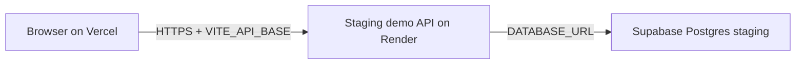

# Staging Demo API Setup (Option B — step by step)

**Purpose:** Let the Vercel web app log in online using **synthetic data only**.  
**Release state:** **NOT READY** — no real patients, no production use.

This is a **staging demo API**, not your real clinic LAN gateway.

---

## What you already have

| Item | Status |
|------|--------|
| Web on Vercel | **Live** — https://klickit-web-2c63.vercel.app |
| Staging API (Render) | **Live** — https://klickit-staging-api.onrender.com |
| Supabase staging DB | **Live** — project `klickit-staging` (Mumbai), migrations + seed applied |
| Password login online | **Verified** — owner confirmed 2026-07-22 |

---

## What we are building



---

## Safety rules (read once)

- **Synthetic data only** in the staging Supabase project.
- **Never** put real patient names, phone numbers, or WhatsApp messages in staging.
- **Never** paste database passwords or API keys in chat.
- The **Owner Demo Login** button only works on your laptop. Online staging uses **Password Login** instead.

---

## Costs (approximate)

| Service | Plan | Cost |
|---------|------|------|
| Supabase staging project | Free | $0 |
| Render staging API | Free tier to start | $0 (may sleep when idle) |
| Vercel web | Hobby (already set up) | $0 now |

If Render free tier is too slow or sleeps, upgrade later with **`APPROVE PAID SUBSCRIPTION`** (~$7–10/month).

---

## Step 1 — Create Supabase staging project

**Stop:** Do this yourself in the browser. Reply **`APPROVE SERVICE CONNECTION`** if you want Cursor to help with Supabase CLI later (never paste secrets in chat).

1. Open **https://supabase.com/dashboard**
2. Click **New project**
3. Name: **`klickit-staging`**
4. Database password: choose a strong password and **save it in your password manager** (not in chat)
5. Region: pick closest to India (e.g. **Singapore** or **Mumbai** if listed)
6. Plan: **Free**
7. Click **Create new project** and wait until status is **Healthy**

**Tell me:** **`supabase project created`**

---

## Step 2 — Apply database schema + seed (synthetic)

After Step 1, we run migrations and seed on the staging project.

**Option A — you prefer clicks (SQL Editor):**

1. Supabase dashboard → **SQL Editor**
2. We will give you a single safe apply command to run from your PC (not in chat)

**Option B — Supabase CLI (recommended after `APPROVE SERVICE CONNECTION`):**

From your project folder in PowerShell:

```powershell
npx.cmd supabase login
npx.cmd supabase link --project-ref YOUR_PROJECT_REF
npx.cmd supabase db push
```

Then load synthetic seed (developer runs this — contains no secrets):

```powershell
# After link: applies supabase/seed.sql to staging (synthetic dev.admin user)
npx.cmd supabase db execute --file supabase/seed.sql
```

(`db execute` availability depends on CLI version; SQL Editor paste is the fallback.)

**Tell me:** **`database ready`** when migrations + seed are done.

---

## Step 3 — Copy database connection string

1. Supabase → **Project Settings** → **Database**
2. Under **Connection string**, choose **URI**
3. Copy the string that starts with `postgresql://postgres:...`
4. Replace `[YOUR-PASSWORD]` with the password you saved
5. Keep this string **private** — you will paste it only into **Render**, not in chat

**Tell me:** **`have database url`** (do not paste the URL here)

---

## Step 4 — Deploy staging API on Render

**Stop:** Creating a Render account is free. Reply **`APPROVE SERVICE CONNECTION`** if you want browser help.

1. Open **https://render.com** and sign up / log in
2. Click **New +** → **Blueprint**
3. Connect GitHub repo **`rohitgds/Klickit`**
4. Select branch **`remediation/pilot-safety`**
5. Render reads `render.yaml` from the repo
6. When asked for secrets, set:

| Key | Value |
|-----|--------|
| `DATABASE_URL` | Your Supabase URI from Step 3 |
| `GATEWAY_CORS_ORIGINS` | `https://klickit-web-2c63.vercel.app` |

7. Click **Apply** and wait until the service shows **Live**
8. Copy the public URL (like `https://klickit-staging-api.onrender.com`)

**Tell me:** **`api live`** and paste only the **public HTTPS URL** (no secrets).

---

## Step 5 — Point Vercel web at the API

1. Vercel → project **`klickit-web-2c63`** → **Settings** → **Environment Variables**
2. Add:

| Name | Value | Environment |
|------|--------|-------------|
| `VITE_API_BASE` | Your Render API URL (no trailing slash) | Production |

Example: `https://klickit-staging-api.onrender.com`

3. **Save**
4. **Deployments** → latest → **Redeploy** (so the build picks up the new variable)

**Tell me:** **`vercel redeployed`**

---

## Step 6 — Test login (click-by-click)

1. Open **https://klickit-web-2c63.vercel.app**
2. Scroll to **Password Login (advanced)** — do **not** use Owner Demo Login online
3. Login name: **`dev.admin`**
4. Password: **`DevPass123!`**
5. Click **Sign In with Password**
6. You should reach the **Dashboard**

If it fails, note the exact error message and tell me.

---

## Staging login reference (synthetic only)

| Login name | Password | Role |
|------------|----------|------|
| `dev.admin` | `DevPass123!` | Full clinic admin |
| `dev.reception` | `DevPass123!` | Reception |

These exist only in the **staging** database after seed runs.

---

## Environment variables reference (names only)

| Variable | Where | Purpose |
|----------|--------|---------|
| `APP_ENV` | Render | `staging` |
| `DATABASE_URL` | Render secret | Supabase direct URL (legacy; IPv6 may fail from Render free tier) |
| `GATEWAY_DATABASE_URL` | Render secret | **Use Supabase Session pooler (IPv4)** — overrides `DATABASE_URL` for DB connectivity |
| `GATEWAY_CORS_ORIGINS` | Render / `render.yaml` | Must be `https://klickit-web-2c63.vercel.app` — never the literal text `undefined` |
| `KLICKIT_CLINIC_CODE` | Render | `DEV` (matches seed) |
| `KLICKIT_GATEWAY_CODE` | Render | `DEV-GW-01` (matches seed) |
| `VITE_API_BASE` | Vercel | Render API URL at build time |

---

## Approved phrases still required

| Action | Phrase |
|--------|--------|
| Supabase / Render setup help in Cursor | `APPROVE SERVICE CONNECTION` |
| Paid Render/Railway upgrade | `APPROVE PAID SUBSCRIPTION` |
| Formal staging sign-off | `DEPLOY STAGING` |

---

## Undo

- **Render:** delete the `klickit-staging-api` service
- **Supabase:** delete project `klickit-staging`
- **Vercel:** remove `VITE_API_BASE` and redeploy

---

## Related docs

- `STAGING_VERCEL_HOBBY_RUNBOOK.md` — web deploy (done)
- `STAGING_OWNER_ANSWERS.md` — your choices
- `WEB_DEPLOYMENT_READINESS.md` — architecture audit
